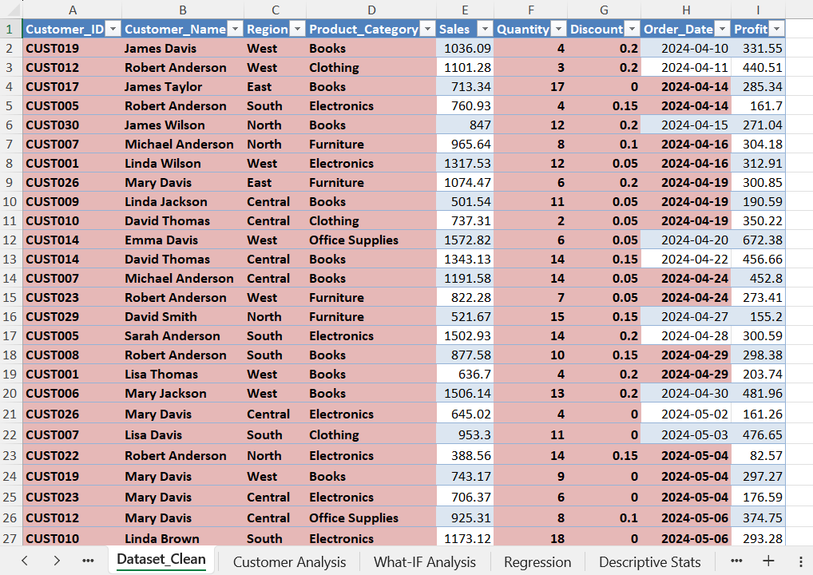
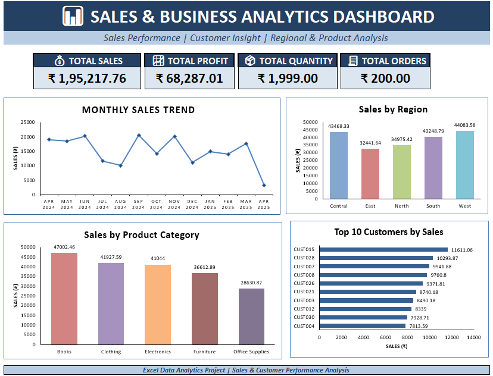

# 📊 Sales & Business Analytics – Excel Project

## 📌 Project Overview

This project is an **Excel-based Sales & Business Analytics project** focused on understanding sales performance, customer behavior, product categories, regional performance, monthly trends, and business scenarios.

The project transforms raw transactional data into meaningful insights using Excel analysis, formulas, Pivot Tables, statistical tools, and data visualization.

---

## 🎯 Objectives

- Analyze overall sales, profit, quantity, and orders
- Understand regional and product-category performance
- Identify high-performing customers
- Track monthly sales and growth
- Analyze relationships between business variables
- Perform scenario-based What-If analysis
- Build a clear business dashboard

---

## 🗂️ Dataset

The dataset contains **200 sales transactions** with information such as:

- Customer ID & Customer Name
- Region
- Product Category
- Sales
- Quantity
- Discount
- Order Date
- Profit

The data was cleaned and structured before performing the analysis.

### 🧹 Clean Dataset

The cleaned dataset serves as the foundation for all the analysis performed in this project. It organizes the transaction-level information into a consistent format suitable for calculations, Pivot Tables, charts, and statistical analysis.

---

# 📊 Dashboard

The dashboard provides a consolidated view of the business using KPI cards and visualizations.

It covers:

- Overall Sales
- Total Profit
- Total Quantity
- Total Orders
- Monthly Sales Trend
- Regional Sales
- Product Category Sales
- Top Customers

### 💡 Insight

The dashboard makes it easier to understand overall business performance at a glance and identify areas requiring deeper analysis.

---

# 👥 Customer Analysis

The Customer Analysis sheet summarizes each customer's:

- Total Sales
- Total Quantity
- Total Profit
- Total Orders
- Performance Rank

### 💡 Insight

This analysis helps identify high-value customers and understand which customers contribute significantly to overall sales and profit. It can support customer retention, segmentation, and targeted business strategies.

---

# 📅 Monthly Sales Growth

This analysis tracks sales performance month by month and calculates the percentage change from the previous month.

### 💡 Insight

The results show that sales fluctuate considerably across the analyzed period, with multiple months showing both growth and decline. This helps identify stronger and weaker sales periods and provides a basis for investigating possible seasonal or business-related changes.

---

# 🔄 Pivot Analysis

The Pivot Analysis compares **Sales across Regions and Product Categories**.

### 💡 Insight

This analysis provides a more detailed view of where sales are being generated by combining geographic and product-level information. It helps identify strong and weak region-category combinations and can support decisions related to product focus and regional strategies.

---

# 📐 Descriptive Statistics

Descriptive Statistics are used to summarize the distribution and variation of key numerical variables such as Sales, Quantity, Discount, and Profit.

### 💡 Insight

The analysis helps understand the typical transaction values, variation within the dataset, and the minimum and maximum values. This provides a statistical overview of the dataset before making business interpretations.

---

# 📉 Regression Analysis

Regression Analysis was performed to examine the relationship between **Sales and Profit**.

### 💡 Insight

The analysis indicates a positive relationship between Sales and Profit within this dataset. It helps understand how changes in Sales are associated with changes in predicted Profit and provides a statistical perspective on business performance.

---

# 🎯 What-If Analysis

The What-If Analysis allows different percentage assumptions to be applied to key business metrics such as Sales, Quantity, and Profit.

### 💡 Insight

This provides a simple scenario-planning tool where changing the assumed growth percentage automatically shows the corresponding projected values. It can be used to explore potential business scenarios without modifying the original dataset.

---

# 🛠️ Tools & Techniques

### Excel
- Data Cleaning
- Excel Tables
- Formulas
- Conditional Formatting
- Pivot Tables
- Pivot Charts
- Regression Analysis
- Descriptive Statistics
- What-If Analysis
- KPI Dashboard
- Data Visualization

### Analytics
- Sales Analysis
- Customer Analysis
- Regional Analysis
- Product Analysis
- Trend Analysis
- Growth Analysis
- Scenario Analysis

---

# 🔍 Overall Business Insights

The project provides a complete view of sales performance from multiple perspectives:

- **Customer level** → identifies high-value customers
- **Product level** → compares category performance
- **Regional level** → evaluates geographic sales distribution
- **Time level** → tracks monthly sales and growth
- **Statistical level** → examines data distribution and relationships
- **Scenario level** → evaluates potential changes through What-If analysis

Together, these analyses demonstrate how Excel can be used to transform raw transaction data into actionable business insights.

👩‍💻 Author

Iqra Rangrej

BBA Student | Data Analytics Enthusiast

Skills Used:
Excel • Data Analysis • Data Visualization
